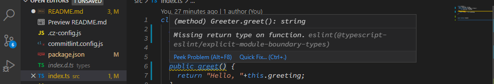

# typescript-starter
从零开始构建typescript开发项目

## 配置环境

本项目配置主要包含：
- Git commit Message
- Typescript
- Eslint
- Prettier


采用 NPM 可以对任何普通的项目进行初始化操作，执行 [`npm init`](https://docs.npmjs.com/cli/init) 会在项目根目录下生成 `package.json` 包描述文件。

> 温馨提示：更多关于该配置的变更可以查看 [Commit](https://github.com/SUN-LG/typescript-starter/commit/8b28b61228e5f5e010c7a3388c9807bdcd2c97d4)

### Git Commit Message

[Commitizen](https://github.com/commitizen/cz-cli) 是一个规范Git提交说明（Commit Message）的CLI工具，具体配置可查看[Cz 工具集使用介绍](https://juejin.im/post/5cc4694a6fb9a03238106eb9)。本项目中主要使用了以下工具：

- [cz-customizable](https://github.com/leonardoanalista/cz-customizable)
- [commitlint](https://commitlint.js.org/#/)
- [conventional-changelog](https://github.com/conventional-changelog/conventional-changelog/tree/master/packages/conventional-changelog)]

配置以后得到以下一些特性：

- 使用 `git cz` 代替 `git commit` 提交符合 Angular 规范的 Commit Message
- 代码提交前会通过 [husky](https://github.com/typicode/husky) 配合 git hook 进行提交信息校验，提交信息不符合 Angular 规范，则会失败，终止提交。
- 执行 `npm run changelog` 会在跟目录生成 `CHANGELOG.md` 版本日志

例如当你提交了一个不符合规范的 Commit Message（此时提交失败）：

```javascript
PS C:\Code\Git\algorithms> git commit -m "这是一个不符合规范的 Commit Message"
husky > commit-msg (node v12.13.1)
⧗   input: 这是一个不符合规范的 Commit Message
✖   subject may not be empty [subject-empty]
✖   type may not be empty [type-empty]
✖   found 2 problems, 0 warnings
ⓘ   Get help: https://github.com/conventional-changelog/commitlint/#what-is-commitlint
husky > commit-msg hook failed (add --no-verify to bypass)
```

> 温馨提示：如果不知道什么是 CLI （命令行接口），可查看 [使用 NPM 发布和使用 CLI 工具](https://juejin.im/post/5eb89053e51d454de54db501)。

### Typescript

本项目会构建输出 CommonJS 工具包（npm包）供外部使用，采用 Typescript 设计并输出声明文件，有助于外部更好的使用该资源包。除此之外，typescript 可以避免 JavaScript 动态特性所带来的一些无法预料的错误（具体可查看 [Top 10 JavaScript errors from 1000+ projects (and how to avoid them)](https://rollbar.com/blog/top-10-javascript-errors/)）

TypeScript 的构建方式有很多种，除了原生编译器 tsc 以外，还包括 Webpack、Rollup、 Babel 以及 Gulp 等（更多构建工具的集成可查看 [Integrating with Build Tools](https://www.typescriptlang.org/docs/handbook/integrating-with-build-tools.html):

- webpack 主要用于页面应用模块化构建，使用webpack构建后增加库的体积，因此工具库制作使用webpack完全是“杀鸡用牛刀”
- Rollup 是一个轻量的构建构建库的打包器，它支持 [Tree Shaking](https://github.com/rollup/rollup)，以及 [ES Module](https://github.com/rollup/rollup/wiki/ES6-modules)，被广泛应用于，react、Vue等库的开发。
- Babel 对应Typescript可以使用 [@babel/preset-typescript](https://babeljs.io/docs/en/babel-preset-typescript) 去除 TypeScript 类型标记，但是做不到类型编译检查，更多关于 Babel 对于 TypeScript 支持的限制可查看 [@babel/plugin-transform-typescript - Caveats](https://www.babeljs.cn/docs/babel-plugin-transform-typescript#caveats) 或 [Babel 7 or TypeScript](https://kulshekhar.github.io/ts-jest/user/babel7-or-ts)。
- Gulp 是一个非常轻量的，并且也是Typescript官方推荐的构建工具，具体可以查看 [TypeScript - Building](https://github.com/microsoft/TypeScript#building)，简单的 Gulp 配置可查看 [TypeScript 中文网 - Gulp](https://www.tslang.cn/docs/handbook/gulp.html)。

> 温馨提示：更多构建工具可以了解 [esbuild](https://github.com/evanw/esbuild)、[parcel](https://github.com/parcel-bundler/parcel)以及 [backpack](https://github.com/jaredpalmer/backpack) 等。

#### Typescript 配置

Typescript 编译采用官方推荐的 Gulp 工具，配合 [gulp-typescript](https://github.com/ivogabe/gulp-typescript) 和 [tsconfig.json](https://www.tslang.cn/docs/handbook/tsconfig-json.html) 配置文件，可快速进行项目构建。在根目录下新建 `tsconfig.json` 文件并新增以下配置： 


```javascript
{
  "compilerOptions": {
    // 指定 ECMAScript 目标版本 "ES3"（默认）， "ES5"， "ES6" / "ES2015"， "ES2016"， "ES2017" 或 "ESNext"。
    "target": "ES5",
    // 构建的目标代码删除所有注释，除了以 /!* 开头的版权信息
    "removeComments": true,
    // 可配合 gulp-typescript 生成相应的 .d.ts 文件
    "declaration": true,
    // 启用所有严格类型检查选项。启用 --strict 相当于启用 --noImplicitAny, --noImplicitThis, --alwaysStrict， --strictNullChecks, --strictFunctionTypes 和 --strictPropertyInitialization
    "strict": true,
    // 禁止对同一个文件的不一致的引用
    "forceConsistentCasingInFileNames": true,
    // 报错时不生成输出文件
    "noEmitOnError": true
  }
}
```

> 温馨提示：这里没有配置 `module`信息，因为默认输出 CommonJS规范，更多关于 TypeScript 配置信息可查看 [Typescript 官方文档 / 编译选项](https://www.tslang.cn/docs/handbook/compiler-options.html)。如果对于 CommonJS 和 ES Moudle 规范的区别不是很清晰，这里有一篇非常好的文档[ES modules: A cartoon deep-dive](https://hacks.mozilla.org/2018/03/es-modules-a-cartoon-deep-dive/)、[ES6 modules](https://github.com/rollup/rollup/wiki/ES6-modules)、以及 [pkg.module](https://github.com/rollup/rollup/wiki/pkg.module)。

同时在根目录下新建 `gulpfile.js` 文件：

```javascript
const gulp = require("gulp");
const ts = require("gulp-typescript");
const tsProject = ts.createProject("tsconfig.json");
// 输出 CommonJS 规范到 dist 目录下
gulp.task("default", function () {
  const tsResult = tsProject.src().pipe(tsProject());
  return tsResult.js.pipe(gulp.dest("dist"));
});
```

在 `package.json` 中新增 script 脚本：

```javascript
"scripts": {
  "build": "rimraf dist && gulp"
},
```

其中 [rimraf](https://github.com/isaacs/rimraf) 用于构建之前清除 dist 目录中的文件。使用 `npm run build` 命令，构建编译 `src` 下的 typescript 源码并输出 CommonJS 规范的代码到 `dist` 目录下。

除此之外，项目希望可以快速生成声明文件供外部调用，进行代码提示。此时仍然可以借助 `gulp-typescript` 工具自动生成声明文件。在 `gulpfile.js` 中新增以下配置：

```javascript
const gulp = require("gulp");
const ts = require("gulp-typescript");
const tsProject = ts.createProject("tsconfig.json");
const merge = require("merge2");
// 输出 CommonJS 规范到 dist 目录下
gulp.task("default", function () {
  const tsResult = tsProject.src().pipe(tsProject());
  return merge([
    tsResult.dts.pipe(gulp.dest("types")),
    tsResult.js.pipe(gulp.dest("dist")),
  ]);
});
```

修改 `build` 命令，使其在构建前，同时删除 `dist` 和 `types` 目录：

```javascript
"scripts": {
  "build": "rimraf dist types && gulp",
},
```

再次执行 `npm run build` 会在项目根目录生成 `types` 文件夹，该文件夹主要存放自动生成的 Typescript 声明文件。

需要注意发布 npm 包时默认会将当前项目的所有文件进行发布处理，如果你希望只发布编译过后的 `dist` 和 `types`，通过 `package.json` 中的 [files](https://docs.npmjs.com/files/package.json#files) （用于指定发布的 NPM 包，包含哪些文件）字段进行控制：

```javascript
"files": [
  "dist",
  "types"
],
```

> 温馨提示：发布的 npm 包中的某些文件将会忽略 `files` 字段的配置。包括 `package.json`、`LICENSE`、`README.md` 等。

除此之外，如果你希望发布的 npm 包被 `require('package-name')` 或 `import` 形式引入时指向 `dist/index.js` 文件，那么需要配置 `package.json` 中的 [main](https://docs.npmjs.com/files/package.json#main) 字段信息：

```javascript
"main": "dist/index.js"
```

> 温馨提示： 对于工具包使用全量引入的方式并不是一个好的选择，可以通过具体的工具方法进行按需引入。

### ESlint

#### ESLint 背景

TypeScript 的代码检查工具主要有 TSLint 和 ESLint 两种。早期的 TypeScript 项目一般采用 TSLint 进行检查，TSLint 和 TypeScript 采用同样的 AST 格式进行编译，但主要问题是对于 JavaScript 生态的项目支持不够友好，因此 TypeScript 团队在 2019 年宣布全面转向 ESLint（具体可查看 TypeScript 官方仓库的 [`.eslintrc.json`](https://github.com/microsoft/TypeScript/blob/master/.eslintrc.jso) 配置），更多关于转向 ESLint 的原因可查看：

- <https://medium.com/palantir/tslint-in-2019-1a144c2317a9>
- <https://github.com/microsoft/TypeScript/issues/30553>

TypeScript 和 ESlint 使用不同的AST进行解析，因此使用ESlint支持 Typscript 代码检测需要额外的[自定义解析器](https://cn.eslint.org/docs/developer-guide/working-with-custom-parsers)（Custome Parsers，Eslint 的自定义解析器功能需基于[ESTree](https://github.com/estree/estree)），目的是为了能够解析 Typescript 语法并转换成与 ESlint兼容的AST。[@typescript-eslint](https://github.com/typescript-eslint/typescript-eslint#getting-started--installation)在这样的背景下诞生，它会处理所有特定的ESLint配置并调用[@typescript-eslint/typescript-estree](https://github.com/typescript-eslint/typescript-eslint/tree/master/packages/typescript-estree)生成 ESTreet-compatible AST (需要注意，仅仅是兼容ESLint，也能兼容 Prettier)

`@typecsript-eslint` 是一个 Monorepo 体系结构的仓库，采用 [learn](https://github.com/lerna/lerna) 进行设计，除了上述提到的NPM包以外，还包含以下两个重要的NPM包：

- [@typescript-eslint/eslint-plugin](https://github.com/typescript-eslint/typescript-eslint/tree/master/packages/eslint-plugin), 配合`@typescript-eslint/parser`一起使用的 ESLint 插件，可以设置 Typescript 的校验规则。
- [@typescript-eslint/eslint-plugin-tslint](https://github.com/typescript-eslint/typescript-eslint/tree/master/packages/eslint-plugin-tslint): TSLint 向 ESLint 迁移的插件。

> 温馨提示：如果你正在使用 TSLint，并且你希望兼容 ESLint 或者向 ESLint 进行过渡（TSLint 和 ESLint 并存）， 可查看 [Migrating from TSLint to ESLint](https://github.com/typescript-eslint/typescript-eslint#migrating-from-tslint-to-eslint)。除此之外，以上所介绍的这些包发布时版本一致（为了联合使用的适配性），如果还有什么需要注意的话你可能需要关心一下 `@typescript-eslint` 对于 TypeScript 和 ESLint 的版本支持性，更多可查看该库包的 @typescript-eslint/parser 的仓库信息。

#### ESLint 配置

从背景介绍中可以理解，对于全新的 Typescript 项目（直接抛弃 TSLint）需要包含解析能够解析TS的解析器 @typescript-eslint/parser，和校验规则的插件 @typescript-eslint/eslint-plugin，这里需要在项目中就进行安装：

```shell
npm i --save-dev eslint @typescript-eslint/parser @typescript-eslint/eslint-plugin
```

在根目录新建 `.eslintrc.js` 配置文件，设置一下配置：
```javascript
  module.exports = {
    root: true,
    parser: '@typescript-eslint/parser',
    plugins: [
      '@typescript-eslint'
    ],
    extends: [
      'eslint:recommended',
      'plugin:@typescript-eslint/recommended'
    ]
  }
```

其中：

- `parser: '@typescript-eslint/parser'`：使用 ESlint 解析 Typescript 语法
- `plugins: ['@typescript-eslint']`: 加载 `@typescript-eslint/eslint-plugin` ESLint 插件，用于配置 Typescript 校验规则
- `extends: [...]`: 在ESLint中设置[共享规则配置](https://cn.eslint.org/docs/developer-guide/shareable-configs)，其中`eslint:recommended` 是 ESLint 内置的推荐校验规则配置（也被称作最佳规则实践），`plugin:@typescript-eslint/recommended` 是类似于 `eslint:recommended` 的 TypeScript 推荐校验规则配置。

> 温馨提示：如果你稍微阅读一下 recommended 源码你会发现，其内部可以理解为推荐校验规则的集合。因此如果想基于 `@typescript-eslint/eslint-plugin` 进行自定义规则，则可以参考[TypeScript Supported Rules](https://github.com/typescript-eslint/typescript-eslint/tree/master/packages/eslint-plugin#supported-rules)。
> 温馨提示：[为什么在ESLint输出中看不到TS提示的错误？](https://github.com/typescript-eslint/typescript-eslint/blob/master/docs/getting-started/linting/FAQ.md#why-dont-i-see-typescript-errors-in-my-eslint-output) ESLint 不会复制ts提供的错误信息，因为那样做会减慢ESLint的运行速度，并且重复输出了TS已经提供的错误信息。

配置完成后在 `package.json` 中设置校验命令

```javascript
"scripts": {
  "lint": "eslint src",
}
```

此时如果在 `src` 目录下书写错误的语法，执行 `npm run lint` 就会输出错误信息：

```shell
$ npm run lint

> typescript-starter@1.0.0 lint D:\workspace\learn\typescript-starter
> eslint src


D:\workspace\learn\typescript-starter\src\index.ts
  6:3  warning  Missing return type on function  @typescript-eslint/explicit-module-boundary-types

✖ 1 problem (0 errors, 1 warning)
```

> 温馨提示：输出的错误信息是通过 [ESLint Formatters](https://cn.eslint.org/docs/user-guide/formatters/) 生成，查看 ESLint 源码并调试可发现默认采用的是 [stylish](https://cn.eslint.org/docs/user-guide/formatters/#stylish) formatter。

为了防止不需要ESLint校验了一些不需要校验的文件（例如配置文件，types文件夹下的文件），可以通过 `.eslintignore` 文件进行配置：

```javascript
# gulp
gulpfile.js

# eslint
.eslintrc.js

# commitizen
commitlint.config.js
.cz-config.js

#jest
jest.config.js

#build
dist
types
```

除此之外，需要在构建前进行 ESLint 校验，一旦 ESLint 校验不通过则不允许进行源码的构建操作：

```javascript
"scripts": {
  "lint": "eslint src --max-warnings 0",
  "build": "npm run lint && rimraf dist types && gulp",
}
```

需要注意在构建时需要进行校验的严格控制，一旦 lint 抛出 warning 或者 error 则立马终止构建（详情可查看 [ESLint 退出代码](https://cn.eslint.org/docs/user-guide/command-line-interface#exit-codes)）。

> 温馨提示：需要注意 Shell 中的 `&&` 和 `&` 是有差异的，`&&` 主要用于顺序执行，如果其中一个脚本失败退出那么整个组合脚本执行失败，`&` 主要用于并发执行，表示两个脚本同时执行。这里构建的命令需要等待 `lint` 命令执行通过才能进行，一旦 `lint` 失败那么构建命令将不再执行。


#### ESlint vscode 插件

如果不使用插件，很难发现写的代码可能存在 TypeScript 格式错误（除非手动 `npm run lint` 或监听代码的变更并实时运行 `npm run lint`），此时可以通过 VS Code 插件进行处理。安装 ESLint 插件后可进行代码的实时提示，具体如下图所示：



此时可以发现之前执行 `lint` 命令的错误通过插件的形式可实时在 VS Code 编辑器中进行显示。除此之外，一些简单的 ESLint 格式错误（例如 多余的`;` 等）可通过配置 Save Auto Fix 进行保存自动格式化处理。具体 VS Code 的配置可参考 [ESLint 插件](https://marketplace.visualstudio.com/items?itemName=dbaeumer.vscode-eslint)的文档说明，这边应该需要进行如下配置：

``` javascript
"editor.codeActionsOnSave": {
  "source.fixAll": true,
  "source.fixAll.eslint": true
}
```

> 温馨提示：VS Code 的配置分为两种类型（用户和工作区），针对上述通用的配置主要放在用户里，针对不同项目的不同配置则需要放入工作区进行处理。


### Prettier

#### Prettier 背景

Prettier 是一个统一代码风格的工具，如果你不清楚为什么需要使用 Prettier，可以查看 [Why Prettier?](https://prettier.io/docs/en/why-prettier.html)。可能很多人存疑，ESLint 已经能够规范我们的代码风格，为什么还需要 Prettier？在[Prettier Vs Linters](https://prettier.io/docs/en/comparison.html) 中详细说明了两者的区别，Linters 有两种类型的规则：

- 格式规则（Formatting rules）：例如 [max-len](https://eslint.org/docs/rules/max-len)、[keyword-spacing](https://eslint.org/docs/rules/keyword-spacing)以及 [no-mixed-spaces-and-tabs](https://eslint.org/docs/rules/no-mixed-spaces-and-tabs) 等
- 质量规则（Code-quality rules）：例如 [no-unused-vars](https://eslint.org/docs/rules/no-unused-vars)、[no-implicit-globals](https://eslint.org/docs/rules/no-implicit-globals) 以及 [prefer-promise-reject-errors](https://eslint.org/docs/rules/prefer-promise-reject-errors) 等

ESLint 的规则校验同时包含了 **格式规则** 和 **质量规则**，但是需要注意的是大部分情况下只有 **格式规则** 可以通过 `--fix` 或 vscode 的 Auto Fix 功能一键修复，而 **质量问题** 更多的是代码错误，往往需要手动修复。因此 **格式规则** 并不是必须的。Prettier 和 ESLint 的区别在于 Prettier 专注于统一的 **格式规则**，从而减轻 ESLint 在 **格式规则** 上的校验，而 **质量规则** 则交给专业的 ESlint 进行处理。总结一句话就是：Prettier for formatting and linters for catching bugs!（ESLint 是必须的，Prettier 是可选的！）

需要注意的是如果 ESlint 和 Prettier 配合使用 **格式规则** 会有重复，导致冲突，那么在编辑器中使用 Save Auto Fix 时会让你的一键格式化哭笑不得。此时应该让两者把各自注重的规则功能区分开，使用 ESLint 校验 **质量规则** 而 **格式规则** 则交给 Prettier 进行处理，更多信息参考：[Integrating with Linters](https://prettier.io/docs/en/option-philosophy.html)，个人认为了解一个产品设计的**哲学**能更好的指导你使用该产品。

#### Prettier 配置

首先安装 Prettier 及所需的依赖：

```shell
npm i  prettier eslint-config-prettier --save-dev
```

其中：`[eslint-config-prettier](https://github.com/prettier/eslint-config-prettier)`：用于解决 ESlint 和 Prettier 配合使用时，冲突的 **格式规则**问题。其原理就是关闭 ESLint中的一些格式规则，除此之外还包括关闭 `@typescript-eslint/eslint-plugin`、`eslint-plugin-babel`、`eslint-plugin-react`、`eslint-plugin-vue`、`eslint-plugin-standard` 等格式规则。
理论上而言，在项目中开启了 ESLint 的 `extends` 中设置了带有格式规则校验的规则集，那么就需要通过 `eslint-config-prettier` 插件关闭可能产生冲突的相对应的格式规则：

```javascript
{
  "extends": [
    "plugin:@typescript-eslint/recommended",
    // 用于关闭 ESLint 相关的格式规则集，具体可查看 https://github.com/prettier/eslint-config-prettier/blob/master/index.js
    "prettier",
    // 用于关闭 @typescript-eslint/eslint-plugin 插件相关的格式规则集，具体可查看 https://github.com/prettier/eslint-config-prettier/blob/master/%40typescript-eslint.js
    "prettier/@typescript-eslint",
  ]
}
```

配置完成之后，可以通过[命令行接口](https://prettier.io/docs/en/cli.html)运行 Prettier:

```javascript
"scripts": {
  "prettier": "prettier src test --write",
},
```

`--write` 参数类似于 ESLint 中的 `--fix`（在 ESLint 中使用该参数还是需要谨慎哈，建议还是使用 VS Code 的 Save Auto Fix 功能），用于自动修复格式错误。此时书写的错误格式的代码：
```javascript
class Greeter {
  public greeting: string;
  public constructor(message: string) {
    this.greeting = message;
  }
  public greet() {
    return "Hello, " + this.greeting;
  }
}


export default Greeter;
```

执行 `npm run prettier` 进行格式修复：

```shell
$ npm run prettier

> typescript-starter@1.0.0 prettier D:\workspace\learn\typescript-starter
> prettier src --write

src\index.ts 390ms
```

修复之后的文件如下：

```javascript
class Greeter {
  public greeting: string;
  public constructor(message: string) {
    this.greeting = message;
  }
  public greet() {
    return "Hello, " + this.greeting;
  }
}

export default Greeter;
```

需要注意的是，如果某些规则集没有对应的 `eslint-config-prettier/xxx` 关闭配置，那么可以先通过 [CLI helper tool](https://github.com/prettier/eslint-config-prettier#cli-helper-tool) 检测是否有冲突的格式规则集生效，然后通过手动配置 `eslintrc.js` 的形式进行关闭 （例如本项目中的 `plugin:@typescript-eslint/@recommended` 可能存在冲突）

例如把 `eslint-config-prettier` 的配置去除，此时进行检查重复规则：

```shell 
$ npx eslint --print-config src/index.ts | npx eslint-config-prettier-check
The following rules are unnecessary or might conflict with Prettier:

- @typescript-eslint/no-extra-semi
```

此时假设 `eslint-config-prettier` 没有类似的关闭格式规则集，那么可以通过配置 `.eslintrc.js` 的形式自己关闭相应冲突的格式规则。

```javascript
  rules: {
    '@typescript-eslint/no-extra-semi': 'off'
  }
```

> 温馨提示：ESLint 可以对不同的文件支持不同的规则校验，因此 `--print-config` 的形式只能对单个文件潜在的冲突进行检查。通常由于整个项目都是一套规则，因此只需要校验一个文件潜在的冲突即可。

#### Prettier vscode 插件

通过命令行接口 `--write` 的形式可以进行格式自动修复，但是类似 ESLint，我们更希望项目在实时编辑的时候可以通过保存就自动格式化代码（鬼知道 `--fix` 以及 `--write` 格式了什么文件，当然更希望通过肉眼的形式立即感知格式化），此时可以通过配置 VS Code 的 [Prettier - Code formatter](https://marketplace.visualstudio.com/items?itemName=esbenp.prettier-vscode) 插件进行 Save Auto Fix，具体的配置查看插件文档。

#### Prettier Pre-Commit Hook

和 ESLint 一样，尽管可能配置了 Prettier 的自动修复格式脚本 以及 VS Code 插件，但是无法确保格式遗漏的情况，因此还需要一层保障能够确保代码提交之前所有的代码能够进行 Prettier 格式化，这个配置将在 Lint Staged 中讲解，更多配置方案也可以查看 [Prettier - Pre-commit Hook](https://prettier.io/docs/en/precommit.html)。


### Lint Staged

使用[commitlint](https://commitlint.js.org/#/)可以防止生成不规范的 Git Commit Message，从而阻止用户进行Git代码提交。单随之项目的增大，全量代码检测则会成为一个问题。[Lint-Stated](https://github.com/okonet/lint-staged)，可以在用户提交代码之前，使用ESLint检测Git暂存区的代码（`git add` 之后的发生变化的文件），一旦存在 💩 一样不符合校验规则的代码，则可以终止提交行为。根据官方文档执行以下命令自动生成配置项信息：

```shell
npx mrm lint-staged
```

需要注意默认生成的配置文件是针对 JavaScript 环境的，手动修改 `package.json` 中的配置信息，适配 Typescript：

```javascript
"husky": {
  "hooks": {
    "pre-commit": "lint-staged"
  }
},
"lint-staged": {
  // 这里需要注意lint命令脚本的 --max-warnings 0
  // 否则就算存在 warning 也不会终止提交行为
  "*.ts": "npm run lint"
}
```

此时只会检测git暂存区的代码，如果有问题，则会提示错误信息并提交失败：

```javascript
$ git commit -m 'test lint-staged'
husky > pre-commit (node v12.10.0)
[STARTED] Preparing...
[SUCCESS] Preparing...
[STARTED] Running tasks...
[STARTED] Running tasks for *.ts
[STARTED] npm run lint
[FAILED] npm run lint [FAILED]
[FAILED] npm run lint [FAILED]
[SUCCESS] Running tasks...
[STARTED] Applying modifications...
[SKIPPED] Skipped because of errors from tasks.
[STARTED] Reverting to original state because of errors...
[SUCCESS] Reverting to original state because of errors...
[STARTED] Cleaning up...
[SUCCESS] Cleaning up...

× npm run lint:
ESLint found too many warnings (maximum: 0).
npm ERR! code ELIFECYCLE
npm ERR! errno 1
npm ERR! typescript-starter@1.0.0 lint: `eslint src --cache --max-warnings 0 "D:/workspace/learn/typescript-starter/src/index.ts"`
npm ERR! Exit status 1
npm ERR!
npm ERR! Failed at the typescript-starter@1.0.0 lint script.
npm ERR! This is probably not a problem with npm. There is likely additional logging 
output above.

npm ERR! A complete log of this run can be found in:
npm ERR!     C:\Users\Shinelon\AppData\Roaming\npm-cache\_logs\2020-08-16T09_22_12_920Z-debug.log

> typescript-starter@1.0.0 lint D:\workspace\learn\typescript-starter
> eslint src --cache --max-warnings 0 "D:/workspace/learn/typescript-starter/src/index.ts"


D:\workspace\learn\typescript-starter\src\index.ts
  6:3  warning  Missing return type on function  @typescript-eslint/explicit-module-boundary-types

✖ 1 problem (0 errors, 1 warning)

husky > pre-commit hook failed (add --no-verify to bypass)
```

husky 在 `package.json` 中配置了 `pre-commit` 和 `commit-msg` 两个[Git 钩子](https://git-scm.com/book/en/v2/Customizing-Git-Git-Hooks)，pre-commit 钩子会优先执行ESLint校验，如果校验失败终止运行。pre-commit 钩子执行完后会继续执行 commit-msg 钩子校验 Git Commit Message 是否符合规范，如果不符合规范终止提交。


### Jest

#### Jest 配置

本项目的单元测试采用 [Jest](https://jestjs.io/en/) 测试框架，注意如果需要对 Typescript 进行支持，可以通过配合 Babel 使用，具体查看 [Jest - Using TypeScript](https://jestjs.io/docs/en/getting-started#using-typescript), 当然这产生了一些限制（具体可查看 [Babel 7 or TypeScript](https://kulshekhar.github.io/ts-jest/user/babel7-or-ts)）。由于本项目没有采用 Babel 进行转义，并希望能够完美支持类型检查，因此采用了 [ts-jest](https://kulshekhar.github.io/ts-jest/user/install#customizing)。按照官方教程进行安装并初始化：

``` shell
npm install --save-dev jest ts-jest @types/jest
npx ts-jest config:init
```

修改 `jest.config.js` 配置文件：
```javascript
module.exports = {
  preset: "ts-jest",
  testEnvironment: "node",
  // 输出覆盖信息文件的目录
  coverageDirectory: "./coverage/",
  // 覆盖信息的忽略文件模式
  testPathIgnorePatterns: ["<rootDir>/node_modules/"],
  // 如果测试覆盖率未达到 100%，则测试失败
  // 这里可用于预防代码构建和提交
  coverageThreshold: {
    global: {
      branches: 100,
      functions: 100,
      lines: 100,
      statements: 100,
    },
  },
  // 路径映射配置，具体可查看 https://kulshekhar.github.io/ts-jest/user/config/#paths-mapping
  // 需要配合 TypeScript 路径映射，具体可查看：https://www.tslang.cn/docs/handbook/module-resolution.html
  moduleNameMapper: {
    "^@/(.*)$": "<rootDir>/src/$1",
  },
};
```

需要注意路径映射需要 tsconfig.json 同时配置了 `paths` 信息，同时注意将测试代码包含到 TS 的编译目录中。配置完成后在 `package.json` 中配置测试命令：

```javascript
"scripts": {
  "lint": "eslint src --max-warnings 0",
  "test": "jest --bail --coverage",
  "build": "npm run lint && npm run jest && rimraf dist types && gulp",
}
```

jest的命令行参数，可查看[Jest CLI Options](https://jestjs.io/docs/zh-Hans/cli)：

- `bail` 配置作用类型与 ESlint 中的 `max-warning`，表明一旦反向单元测试用例错误就停止运行剩余测试用例，从而可以防止运行用例过多，需要一直等待所有用例运行完毕。
- `coverage` 用于在当前根目录下生产 coverage 测试报告。

> 温馨提示：Jest CLI Options 中的 `findRelatedTests` 可用于配合 `pre-commit` 钩子去运行最少量的单元测试用例，可配合 `lint-staged` 实现类似于 ESLint 的作用，更多细节可查看 [`lint-staged - Use environment variables with linting commands`](https://github.com/okonet/lint-staged#use-environment-variables-with-linting-commands)。
> 温馨提示：配置 tsconfig.json 时，尽量不要设置 `include`、`exclude`、`files` 等选项，除非你明确的知道自己需要配置这些字段，并且明白他们的作用。因为当你配置了 `baseUrl` 和 `paths` 进行路径映射后，`include`、`exclude`、`files` 有可能将你的路径映射目录排除在 ts 的编译目录之外。造成 ts 或 vscode 无法智能提示。

在根目录的 `test` 目录下新建 `greet.spec.ts` 文件，并设计以下测试代码：

```javascript
import Greeter from '@/greet'

describe("src/greet.ts", () => {
  const greeter = new Greeter('world')

  it("name param test", () => {
    expect(greeter.greet()).toBe("hello, from world 1")
  })
})
```

> 温馨提示：测试文件有两种放置风格，一种是新建 `test` 文件夹，然后将所有的测试代码集中在 `test` 目录下进行管理，另外一种是在各个源码文件的同级目录下新建 `__test__` 目录，进行就近测试，大部分的项目可能都会倾向采用第一种目录结构（可以随便找一些 github 上的开源项目进行查看，这里 `ts-test` 则是采用了第二种测试结构）。除此之外，需要注意的一点是 Jest 通过配置 [`testMatch`](https://jestjs.io/docs/zh-Hans/configuration#testmatch-arraystring) 或 [`testRegex`](https://jestjs.io/docs/zh-Hans/configuration#testregex-string--arraystring) 可以使得项目识别特定格式文件作为测试文件进行运行（本项目采用默认配置可识别后缀为 `.spec` 的文件进行单元测试）。

此时可单独通过执行 `npm run test` 命令进行单元测试，这里演示执行构建命令时的单元测试（需要保证构建之前所有的单元测试用例都能通过）。如果测试失败，那么应该防止继续构建，例如进行失败的构建行为：

```javascript
PS C:\Code\Git\algorithms> npm run build
> algorithms-utils@1.0.0 build C:\Code\Git\algorithms
> npm run lint-strict && npm run jest && rimraf dist types && gulp
> algorithms-utils@1.0.0 lint-strict C:\Code\Git\algorithms
> eslint src --max-warnings 0
> algorithms-utils@1.0.0 jest C:\Code\Git\algorithms
> jest --coverage
 PASS  dist/test/greet.spec.js
 FAIL  test/greet.spec.ts
  ● src/greet.ts › name param test
    expect(received).toBe(expected) // Object.is equality
    Expected: "Hello from world 1"
    Received: "Hello from world"
      3 | describe("src/greet.ts", () => {
      4 |   it("name param test", () => {
    > 5 |     expect(greet("world")).toBe("Hello from world 1");
        |                            ^
      6 |   });
      7 | });
      8 |
      at Object.<anonymous> (test/greet.spec.ts:5:28)
----------|---------|----------|---------|---------|-------------------
| File       | % Stmts   | % Branch   | % Funcs   | % Lines   | Uncovered Line #s   |
| ---------- | --------- | ---------- | --------- | --------- | ------------------- |
| All files  | 100       | 100        | 100       | 100       |
| greet.ts   | 100       | 100        | 100       | 100       |
| ---------- | --------- | ---------- | --------- | --------- | ------------------- |
Test Suites: 1 failed, 1 passed, 2 total
Tests:       1 failed, 1 passed, 2 total
Snapshots:   0 total
Time:        3.45 s
Ran all test suites.
npm ERR! code ELIFECYCLE
npm ERR! errno 1
npm ERR! algorithms-utils@1.0.0 jest: `jest --coverage`
npm ERR! Exit status 1
npm ERR!
npm ERR! Failed at the algorithms-utils@1.0.0 jest script.
npm ERR! This is probably not a problem with npm. There is likely additional logging output above.
npm ERR! A complete log of this run can be found in:
npm ERR!     C:\Users\子弈\AppData\Roaming\npm-cache\_logs\2020-07-12T13_42_11_628Z-debug.log
npm ERR! code ELIFECYCLE
npm ERR! errno 1
npm ERR! algorithms-utils@1.0.0 build: `npm run lint-strict && npm run jest && rimraf dist types && gulp`
npm ERR! Exit status 1
npm ERR!
npm ERR! Failed at the algorithms-utils@1.0.0 build script.
npm ERR! This is probably not a problem with npm. There is likely additional logging output above.
npm ERR! A complete log of this run can be found in:
npm ERR!     C:\Users\子弈\AppData\Roaming\npm-cache\_logs\2020-07-12T13_42_11_673Z-debug.log
```

除此之外为了预防不负责任的代码提交，此时配合 `lint-staged` 可以阻止未跑通单元测试的代码进行远程提交：

```javascript
"scripts": {
  "lint": "eslint src --max-warnings 0",
  "test": "jest --bail --coverage",
},
"lint-staged": {
  "*.ts": [
    "npm run lint",
    "npm run test"
  ]
}
```

此时如果单元测试有误（不管是源码逻辑有问题还是单元测试用例本身设计有问题），都会停止代码提交：
```javascript
husky > pre-commit (node v12.13.1)
[STARTED] Preparing...
[SUCCESS] Preparing...
[STARTED] Running tasks...
[STARTED] Running tasks for *.ts
[STARTED] npm run lint
[SUCCESS] npm run lint
[STARTED] npm run jest
[FAILED] npm run jest [FAILED]
[FAILED] npm run jest [FAILED]
[SUCCESS] Running tasks...
[STARTED] Applying modifications...
[SKIPPED] Skipped because of errors from tasks.
[STARTED] Reverting to original state because of errors...
[SUCCESS] Reverting to original state because of errors...
[STARTED] Cleaning up...
[SUCCESS] Cleaning up...
× npm run jest:
FAIL test/greet.spec.ts
  src/greet.ts
    × name param test (4 ms)
  ● src/greet.ts › name param test
    expect(received).toBe(expected) // Object.is equality
    Expected: "Hello from world 1"
    Received: "Hello from world"
      3 | describe("src/greet.ts", () => {
      4 |   it("name param test", () => {
    > 5 |     expect(greet("world")).toBe("Hello from world 1");
        |                            ^
      6 |   });
      7 | });
      8 |
      at Object.<anonymous> (test/greet.spec.ts:5:28)
Test Suites: 1 failed, 1 total
Tests:       1 failed, 1 total
Snapshots:   0 total
Time:        1.339 s, estimated 3 s
Ran all test suites related to files matching /C:\\Code\\Git\\algorithms\\src\\index.ts|C:\\Code\\Git\\algorithms\\test\\greet.spec.ts/i.
npm ERR! code ELIFECYCLE
npm ERR! errno 1
npm ERR! algorithms-utils@1.0.0 jest: `jest --bail --findRelatedTests --coverage "C:/Code/Git/algorithms/src/index.ts" "C:/Code/Git/algorithms/test/greet.spec.ts"`
npm ERR! Exit status 1
npm ERR!
npm ERR! Failed at the algorithms-utils@1.0.0 jest script.
npm ERR! This is probably not a problem with npm. There is likely additional logging output above.
npm ERR! A complete log of this run can be found in:
npm ERR!     C:\Users\子弈\AppData\Roaming\npm-cache\_logs\2020-07-12T14_33_51_183Z-debug.log
> algorithms-utils@1.0.0 jest C:\Code\Git\algorithms
npm ERR! Exit status 1
npm ERR!
npm ERR! Failed at the algorithms-utils@1.0.0 jest script.
npm ERR! This is probably not a problem with npm. There is likely additional logging output above.
npm ERR! A complete log of this run can be found in:
npm ERR!     C:\Users\子弈\AppData\Roaming\npm-cache\_logs\2020-07-12T14_33_51_183Z-debug.log
> algorithms-utils@1.0.0 jest C:\Code\Git\algorithms
> jest --bail --findRelatedTests --coverage "C:/Code/Git/algorithms/src/index.ts" "C:/Code/Git/algorithms/test/greet.spec.ts"
----------|---------|----------|---------|---------|-------------------
| File       | % Stmts   | % Branch   | % Funcs   | % Lines   | Uncovered Line #s   |
| ---------- | --------- | ---------- | --------- | --------- | ------------------- |
| All files  | 0         | 0          | 0         | 0         |
| ---------- | --------- | ---------- | --------- | --------- | ------------------- |
husky > pre-commit hook failed (add --no-verify to bypass)
git exited with error code 1
```
> 温馨提示：更多关于Jest的生态，可以查看 [awesome-jest](https://github.com/jest-community/awesome-jest)。

#### ESLint 的支持

`src` 目录下的源码通过配置 `@typescript-eslint/eslint-plugin` 可进行推荐规则的 ESLint 校验，`test` 目录下的测试代码可以配置符合 Jest 推荐规则的 ESLint 校验，可以通过配置 [eslint-plugin-jest](https://github.com/jest-community/eslint-plugin-jest) 进行支持（`ts-jest` 项目就是采用了该插件进行 ESLint 校验，具体可查看配置文件 [`ts-jest/.eslintrc.js`](https://github.com/kulshekhar/ts-jest/blob/master/.eslintrc.js#L12)）。这里仍然采用推荐规则配置：

```javascript
module.exports = {
  root: true,
  parser: "@typescript-eslint/parser",
  plugins: ["@typescript-eslint"],
  extends: [
    "eslint:recommended",
    "plugin:@typescript-eslint/recommended",
    // 新增推荐的 ESLint 校验规则
    // 所有规则集查看：https://github.com/jest-community/eslint-plugin-jest#rules（recommended 标识表明是推荐规则）
    "plugin:jest/recommended",
  ],
};
```

为了验证推荐规则是否生效，这里可以找一个 [`no-identical-title`](https://github.com/jest-community/eslint-plugin-jest/blob/master/docs/rules/no-identical-title.md) 规则进行验证：

```javascript
import greet from "@/greet";
describe("src/greet.ts", () => {
  it("name param test", () => {
    expect(greet("world")).toBe("Hello from world 1");
  });
});
// 这里输入了重复的 title
describe("src/greet.ts", () => {
  it("name param test", () => {
    expect(greet("world")).toBe("Hello from world 1");
  });
});
```

需要注意修改 `package.json` 中的 ESLint 校验范围：

```javascript
"scripts": {
  // 这里对 src 和 test 目录进行 ESLint 校验
  "lint": "eslint src test --max-warnings 0",
},
```

执行 `npm run lint` 进行单元测试的格式校验：

```javascript
PS C:\Code\Git\algorithms> npm run lint
> algorithms-utils@1.0.0 lint C:\Code\Git\algorithms
> eslint src test --max-warnings 0
C:\Code\Git\algorithms\test\greet.spec.ts
  9:10  error  Describe block title is used multiple times in the same describe block  jest/no-identical-title
✖ 1 problem (1 error, 0 warnings)
npm ERR! code ELIFECYCLE
npm ERR! errno 1
npm ERR! algorithms-utils@1.0.0 lint: `eslint src test --max-warnings 0`
npm ERR! Exit status 1
npm ERR!
npm ERR! Failed at the algorithms-utils@1.0.0 lint script.
npm ERR! This is probably not a problem with npm. There is likely additional logging output above.
npm ERR! A complete log of this run can be found in:
npm ERR!     C:\Users\子弈\AppData\Roaming\npm-cache\_logs\2020-07-13T02_25_12_043Z-debug.log
```

采用ESLint校验之后，在 VS Code 中也实时生成了错误提示（相应的代码下会有红色波浪线，鼠标移入后会产生 Tooltip 提示该错误的相应规则信息，除此之外当前工程目录下对应的文件名也会变成红色）

> 温馨提示：如果你希望 Jest 测试代码也需要一些格式规范，可以查看 [eslint-plugin-jest-formatting](https://github.com/dangreenisrael/eslint-plugin-jest-formatting) 插件。


## 文档

- [Npm 官方文档](https://docs.npmjs.com/)
- [使用 NPM 发布和使用 CLI 工具](https://juejin.im/post/5eb89053e51d454de54db501)
- [Top 10 JavaScript errors from 1000+ projects (and how to avoid them)](https://rollbar.com/blog/top-10-javascript-errors/)
- [Cz 工具集使用介绍](https://juejin.im/post/5cc4694a6fb9a03238106eb9)（强烈推荐阅读）
- [TypeScript 中文网](https://www.tslang.cn/)
- [tsconfig.json 编译选项](https://www.tslang.cn/docs/handbook/compiler-options.html)
- [gulp-typescript](https://github.com/ivogabe/gulp-typescript)
- [ES modules: A cartoon deep-dive](https://hacks.mozilla.org/2018/03/es-modules-a-cartoon-deep-dive/)（强烈推荐阅读）
- [ESLint 中文网](https://cn.eslint.org/)
- [typescript-eslint](https://github.com/typescript-eslint/typescript-eslint)
- [Getting Started - Linting your TypeScript Codebase](https://github.com/typescript-eslint/typescript-eslint/blob/master/docs/getting-started/linting/README.md)